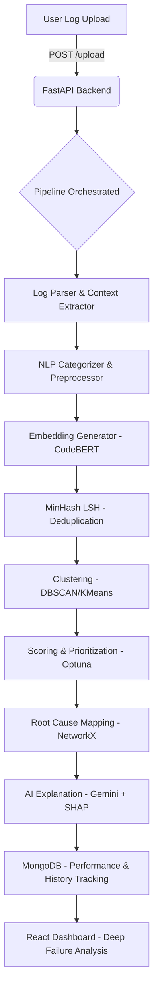

# 🧠 DebugIQ — AI-Powered Simulation Log Analysis

> **"DebugIQ transforms raw hardware logs into prioritized, explainable failure insights using NLP embeddings, clustering, deduplication, and ML-based scoring."**

---

## 🌟 Hackathon Pitch (Top 1% Soundbyte)
"We use a hybrid ML pipeline combining symbolic parsing, transformer embeddings, approximate nearest neighbor search (LSH), density clustering, and multi-factor optimization to convert noisy logs into actionable intelligence."

---

## 🚀 What is DebugIQ?
DebugIQ is an **AI-powered simulation log analysis and failure prioritization platform** built for chip/hardware verification regression logs. It ingests large `.log`/`.txt`/`.gz` files, extracts failures with NLP context awareness, deduplicates semantically similar issues, clusters them, prioritizes via ML scoring, and serves explainable results through a FastAPI backend + React dashboard.

---

## 🧩 Core ML Pipeline
Think of the pipeline like this:
**Raw Logs → Clean Data → Understand Meaning → Remove Duplicates → Group Issues → Rank Importance → Explain**

1.  **Ingestion & Parsing**: Regex-based extraction of failure lines + context window (2 lines before/after).
2.  **Preprocessing**: Lowercasing, symbol removal, and stopword filtering.
3.  **Categorization**: Multi-layer category detection (rule-based keywords + ML sentence embeddings fallback).
    - Categories: `assertion_failure`, `timeout_error`, `protocol_violation`, `data_mismatch`, `memory_error`.
4.  **Embedding Generation**: Logs become vectors (CodeBERT preferred, TF-IDF fallback).
5.  **Deduplication**: Hybrid LSH filter + Cosine similarity (threshold 0.9) + Siamese Network scaffold.
6.  **Clustering**: DBSCAN groups similar issues; PCA projects to 2D for high-quality dashboard visualization.
7.  **Priority Scoring**: Multi-factor ranking: `Score = 0.4*Severity + 0.3*Frequency + 0.2*Module + 0.1*History`.
8.  **Root Cause Analysis**: Temporal graph building via NetworkX to trace chains of failures.
9.  **Explainability**: RAG-style context retrieval + Gemini-1.5-Flash (LLM) + SHAP feature importance.

---

## 🛠️ Full Tech Stack

### Backend — Python 3.11
- **API**: FastAPI, Uvicorn, Pydantic, SlowAPI (rate limiting), JWT Auth.
- **Database**: MongoDB via PyMongo (with auto-increment counters).
- **ML/DS**: Scikit-Learn (DBSCAN, PCA, KMeans), Sentence-Transformers (CodeBERT), Datasketch (LSH), PyTorch (Siamese Networks), Optuna (hyperparameter tuning), SHAP (explainability), NetworkX (graph RCA).
- **Messaging**: RabbitMQ via Pika (async ingestion).
- **LLM**: Google Gemini-1.5-Flash API (primary), OpenAI-compatible (fallback).

### Frontend — React 18 + Vite
- **Visuals**: Recharts (Pie, Bar, Line, Scatter), `react-force-graph-2d` (Cluster/RCA topology), `react-heatmap-grid`.
- **Styling**: Tailwind CSS v3, Lucide React (icons).
- **State/API**: React Router v6, Axios (JWT interceptors).

### Infrastructure
- **Containerization**: Docker & Docker Compose (Backend, Worker, Frontend, RabbitMQ).
- **Proxy**: Nginx (Frontend server & /api proxy).
- **CI**: GitHub Actions (Backend checks & Frontend build).

---

## 🏗️ Architecture Flow



---

## ⚡ Getting Started

### Prerequisites
- Python 3.11+
- Node.js 18+
- MongoDB instance (local or Atlas)
- RabbitMQ (optional for local, required for async)

### 1. Setup Environment
Copy `backend/.env.example` to `backend/.env` and fill in the required variables:
- `MONGO_URI`: Your MongoDB connection string.
- `GEMINI_API_KEY`: API key for Gemini-1.5-Flash.
- `DEBUGIQ_JWT_SECRET`: Random secret string for JWT auth.

### 2. Local Run
**Backend:**
```bash
cd backend
pip install -r requirements.txt
python -m uvicorn main:app --reload --port 8000
```
**Worker (Async Support):**
```bash
cd backend
python worker.py
```
**Frontend:**
```bash
cd frontend
npm install
npm run dev
```

### 3. Docker (Recommended)
```bash
docker compose up --build
```

---

## 🎯 Demo Flow for Judges
1.  **Signup/Login**: Access the app at `http://localhost:5173/login`.
    - *Default Admin*: `admin` / `admin123` (configured via env).
2.  **Upload Log**: Go to the Upload tab and provide a `.log`, `.txt`, or `.gz` simulation file.
3.  **Dashboard Hub**: See failure counts, health scores, and module hotspots.
4.  **Interactive Graph**: Explore failure clusters or root cause chains in a force-directed graph.
5.  **Failure Analysis**: Click any row in the table to see:
    - **Context Window**: Exactly what happened in the logs.
    - **Root Cause Chain**: Temporal sequence leading to the failure.
    - **AI Explanation & Recommendations**: Gemini-powered insights on how to fix the issue.
    - **Model Confidence**: SHAP feature importance explaining why it was prioritized.

---

## 📂 Project Structure Highlights
- `/backend/main.py`: Main FastAPI app with JWT and rate limiting.
- `/backend/mongo_store.py`: MongoDB abstraction & ID management.
- `/backend/services/pipeline.py`: Core orchestration of the ML pipeline.
- `/backend/ml/`: Individual ML modules (dedup, clusters, RCA, scoring, explainability).
- `/frontend/src/api/api.js`: Axios client with JWT interceptors.
- `/frontend/src/components/Dashboard.jsx`: Central command center for analytics.

---

## ⚠️ Known Bugs & Roadmap
- **No Mongo in Compose**: Currently requires external `MONGO_URI` or update to `docker-compose.yml`.
- **Pagination**: Large logs (>1500 failures) need frontend/backend pagination.
- **Token Blacklisting**: JWTs can't be revoked server-side yet.
- **Legacy Code**: `database.py` contains old SQLite models—use `mongo_store.py` for all DB work.

---
**Built with 💡 and 🧀 for the Hackathon.**
